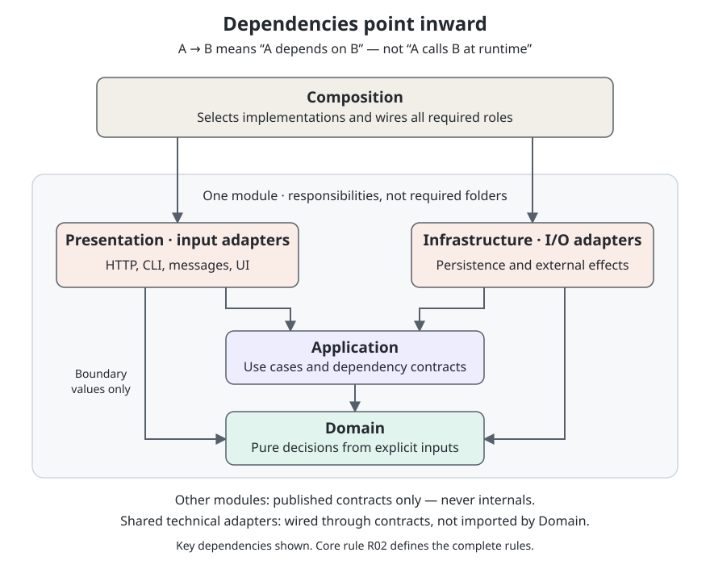

# Architecture Kit for Coding Agents

Language-agnostic architecture guidance for projects where AI agents write the code. This repository is the canonical home of the kit. It contains copyable guidance, enforcement rules, and examples for reference.

## Why architecture still matters

Agents make code cheaper to produce. They do not automatically make the resulting system cheaper to reliably change.

- **Business invariants still need owners.** Code generation does not decide which rules must hold or who may change data.
- **External effects still have limits.** A database rollback cannot undo an email or an HTTP request.
- **Coupling still increases risk.** Broad dependencies expand the scope of changes, verification, and failures.
- **Independent agents need explicit contracts.** Boundaries let agents make bounded changes without reconstructing the whole system or making incompatible assumptions.
- **Correctness still requires evidence.** Plausible code is not proof that a system preserves its invariants.

The kit exists to constrain changes and make architectural guarantees verifiable.

## Design standard

Keep a rule only when it protects correctness, limits coupling or change scope, coordinates ownership, or enables reliable verification. Rules justified solely by human developer convenience do not belong in the kit.

Prioritize:

1. Precise invariants and dependency rules.
2. Automated enforcement, with explicit limits on what tools prove.
3. Explicit data ownership and cross-module contracts.
4. Narrow, documented exceptions.
5. Short explanations of why each rule exists.

Prefer enforceable guarantees over prescribed ceremony. Directory structures, naming conventions, interfaces, and layers must serve those guarantees rather than exist for their own sake. Keep instructions concise and distinguish mandatory rules from defaults and examples.

## Scope

The kit targets modular-monolith applications organized around business or capability boundaries. It applies to HTTP services, CLI applications, message consumers, graphical applications, and other delivery mechanisms that fit that architecture.

It does not require object-oriented programming or a rich domain model in every module. Architectural guarantees should remain consistent across languages; their implementation should follow each language's idioms. Logical responsibilities and dependency directions matter more than identical folder or class structures.

This is a specific architectural approach, not a universal template for every kind of software.

## Architecture at a glance

The diagram shows logical responsibilities, not required folders or runtime call order. Modules interact through published contracts; shared technical adapters are wired through contracts. The [core dependency rules](kit/docs/architecture/rules.md#r02--logical-roles-and-complete-coverage) are authoritative and cover the dependencies omitted from this overview.

## Contents and status

- [`kit/AGENTS.md`](kit/AGENTS.md) — copyable agent instructions.
- [`kit/docs/architecture/rules.md`](kit/docs/architecture/rules.md) — authoritative, language-neutral core with stable rule IDs.
- [`kit/docs/architecture/profiles/`](kit/docs/architecture/profiles/requirements.md) — requirements for language profiles.
- [`kit/docs/architecture/project.md`](kit/docs/architecture/project.md) — target-project configuration template.
- [`enforcement/`](enforcement/requirements.md) — checker acceptance criteria.
- [`examples/`](examples/requirements.md) — the shared invoice-voiding scenario and fixture requirements.

This repository contains guidance and a reference scenario specification, not an application.

## Adoption

1. Copy `kit/docs/architecture/` into the target application's `docs/architecture/`, including `COPYRIGHT`. Copy this distribution's `LICENSE` into that directory too. Retain applicable attribution and identify modifications when redistributing under Apache 2.0.
2. Merge `kit/AGENTS.md` into that application's agent instructions. Preserve existing project instructions and resolve conflicts explicitly. Do not copy this repository's root maintenance `AGENTS.md`.
3. Complete `docs/architecture/project.md`: adopted revision, application roots, language profiles, source/data ownership, execution semantics, verification commands, and deviations. Adjust paths consistently if the project uses a different documentation location.
4. Follow the [greenfield](kit/docs/architecture/greenfield.md) or [migration](kit/docs/architecture/migration.md) procedure. Install only checks whose support and configuration have been verified for the project. Copied documentation is not installed enforcement.

Examples are optional reference evidence, not code every adopting application must include.

The installed guidance is self-contained; repository maintenance files and example sources are not required at runtime. Agents read only the selected language profiles and relevant companions.

## Updating an installed copy

Record the adopted kit revision before local changes. Compare a new revision against that base, merge changes into the installed guidance, and preserve project configuration and explicit deviations. Re-run affected checks and fixtures before updating the recorded revision. Do not overwrite the target project's instructions or assume it already has this repository's tooling.

## License

Copyright 2026 Kevin Smith

Licensed under the Apache License, Version 2.0 (the "License");
you may not use this file except in compliance with the License.
You may obtain a copy of the License at

http://www.apache.org/licenses/LICENSE-2.0

Unless required by applicable law or agreed to in writing, software
distributed under the License is distributed on an "AS IS" BASIS,
WITHOUT WARRANTIES OR CONDITIONS OF ANY KIND, either express or implied.
See the License for the specific language governing permissions and
limitations under the License.
